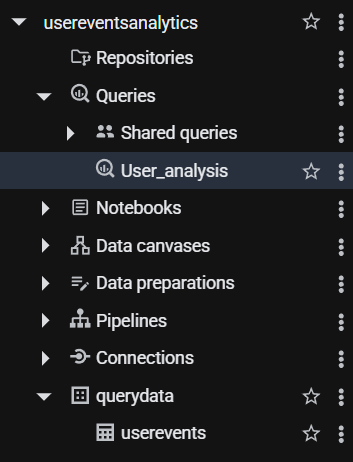
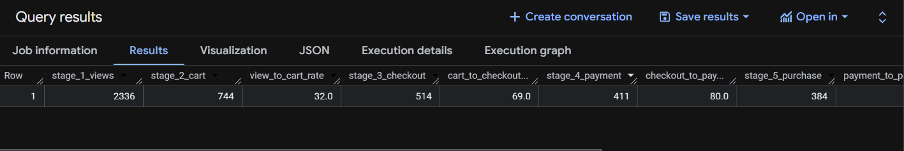
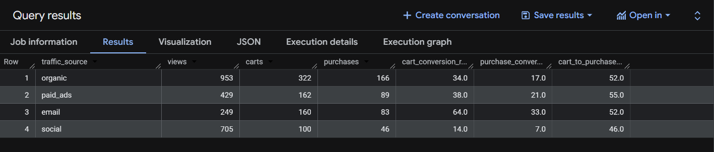
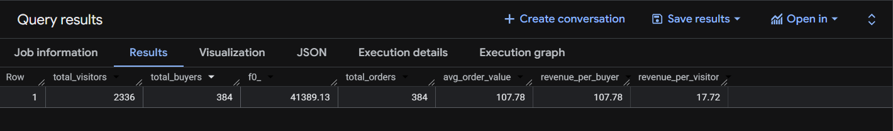

# E-Commerce Conversion & Revenue Optimization (GCP BigQuery)

## Overview
This project demonstrates a comprehensive e-commerce audit leveraging **Google Cloud Platform (GCP)** to analyze **2,336 unique user events**. By transforming raw event logs into a structured 5-stage sales funnel, this analysis identifies high-intent traffic sources, validates technical checkout efficiency, and establishes data-backed financial guardrails for marketing spend.

## Cloud Environment & Architecture
The analysis was performed natively within the **BigQuery** ecosystem. The data resides in a structured warehouse schema under the project `usereventsanalytics`.

*Figure 1: BigQuery Workspace showing the `User_analysis` saved query and the `querydata.userevents` table structure.*

## Analytical Methods & Business Logic

### 1. Multi-Stage Funnel Engineering
* **Method**: Utilized **Common Table Expressions (CTEs)** and `COUNT(DISTINCT CASE WHEN...)` logic to build a 5-stage conversion model (View → Cart → Checkout → Payment → Purchase).
* **Necessity**: Standardizing the user journey into distinct stages allows for the identification of specific "leaks" in the conversion process.

### 2. Marketing Attribution & Efficiency
* **Method**: Aggregated user events by `traffic_source` to calculate the `purchase_conversion_rate` for Organic, Paid, Email, and Social channels.
* **Necessity**: Raw traffic volume is a vanity metric. Calculating channel-specific efficiency reveals that **Email (33%)** drastically outperforms **Social (7%)**, justifying a shift in budget allocation.

### 3. Conversion Velocity Analysis
* **Method**: Applied `TIMESTAMP_DIFF` functions to `MIN` event timestamps to calculate the average minutes between stages.
* **Necessity**: Understanding the speed of conversion (e.g., **24.06 minutes total**) helps determine the timing for "Abandoned Cart" triggers and real-time lead generation.

### 4. Financial Guardrail Modeling
* **Method**: Integrated revenue data to calculate **Average Order Value (AOV)** and **Revenue Per Visitor (RPV)**.
* **Necessity**: Setting a strict **Customer Acquisition Cost (CAC)** limit based on an actual **$107.78 AOV** ensures the business remains profitable at every stage of the funnel.

## Data Outputs & Visualization

### Sales Funnel & Conversion Rates
The funnel demonstrates high efficiency at the bottom, with an elite **93% conversion rate** from payment to purchase.

*Figure 2: SQL Output showing stage-by-stage conversion percentages.*

### Marketing Channel Performance
A clear disparity is identified between high-intent channels (Email) and low-intent "window shoppers" (Social).

*Figure 3: Comparison of traffic volume vs. actual purchase efficiency by source.*

### Revenue & Unit Economics
The financial audit provides the baseline for all marketing ROI calculations.

*Figure 4: Revenue metrics including AOV, Revenue per Buyer, and Revenue per Visitor.*

## Key Insights & Recommendations
* **UX Integrity**: The **80%+ checkout-to-purchase flow** indicates a frictionless technical environment. Redesigning the checkout page is currently unnecessary and high-risk.
* **Budget Realignment**: Redirect Social Media spend from "Traffic" objectives to "Lead Gen" to capture emails, moving users into the 33%-converting email channel.
* **Ad Spend Cap**: To maintain a **$30-$40 CAC**, Social Media CPC must remain below **$2.80** based on current performance.

## Key Tools
* **Google Cloud BigQuery**: Cloud data warehouse and SQL engine.
* **SQL (Standard SQL)**: Primary language for data transformation and modeling.
* **VS Code**: Local environment for managing repository structure and JSON exports.

## Contact
* **Author**: Vishal Lakshmi Narayanan
* **Email**: lvishal1607@gmail.com
* **GitHub**: [@VishalLakshmiNarayanan](https://github.com/VishalLakshmiNarayanan)