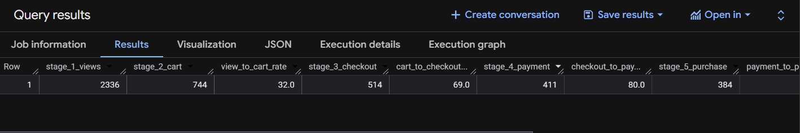
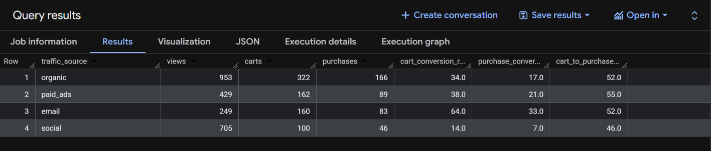
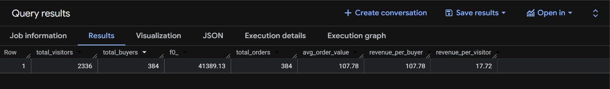

# E-Commerce Conversion & Revenue Optimization (GCP BigQuery)

## Project Background
In a high-growth e-commerce environment, identifying friction points within the sales funnel is the primary lever for maintaining profitability. This project conducts a comprehensive audit of **2,336 unique user events** to map the end-to-end customer journey from initial product discovery to final purchase.

The objective was to identify conversion "leaks," evaluate the efficiency of multi-channel marketing spend, and establish data-backed financial guardrails. By transforming raw event logs into business-ready metrics, this analysis provides a strategic roadmap for resource allocation and UX prioritization.

---

## Data Structure & Overview
The analysis was executed natively within **Google Cloud BigQuery**. The dataset encompasses event-level logs, marketing attribution metadata, and transaction records.

* **User Events:** Unique interaction logs including page views, cart additions, and checkout events.
* **Marketing Metadata:** Multi-channel attribution tags (Social, Email, Paid, Organic).
* **Transaction Data:** Revenue values, order completion status, and product IDs.

---

## Executive Summary
A comprehensive audit of the 5-stage sales funnel reveals an elite technical checkout infrastructure but a significant disparity in marketing channel efficiency. While the bottom-of-funnel conversion is exceptionally high (**93% from payment to purchase**), top-of-funnel quality varies by source. **Email** is the primary driver of high-intent traffic (**33% conversion**), whereas **Social Media** serves primarily as a discovery channel with low conversion intent (**7%**). To maintain the current **$107.78 Average Order Value (AOV)**, the business must pivot its social strategy toward lead capture rather than direct-to-sale objectives.

---

## Key Insights & Visualizations

### 1. Funnel Velocity & Technical Health
* **The Insight:** The transition from **Checkout to Payment is 80%**, and **Payment to Purchase is 93%**.
* **Conversion Velocity:** Converted users move from Cart to Purchase in an average of **13.06 minutes**.
* **Stakeholder Impact:** The technical funnel is frictionless. The rapid conversion speed indicates that high-intent users face no significant UI/UX barriers at the point of sale.

*Figure 1: 5-Stage Conversion Funnel and Drop-off Analysis*

### 2. Multi-Channel Attribution Efficiency
* **The Insight:** Conversion rates vary by nearly 5x across acquisition channels.
    * **Email:** 33.0% (High Intent / Retention)
    * **Paid Ads:** 21.0% (Commercial Intent)
    * **Social:** 7.0% (Discovery / Browsing)
* **Stakeholder Impact:** Social Media currently drives volume but lacks conversion efficiency. The high performance of Email suggests a powerful secondary conversion engine that should be fed more top-of-funnel leads.

*Figure 2: Purchase Conversion Rate by Traffic Source*

### 3. Unit Economics & Profitability
* **The Insight:** The verified **Average Order Value (AOV) is $107.78**, with a **Revenue Per Visitor (RPV) of $17.72**.
* **Stakeholder Impact:** These benchmarks define the ceiling for Customer Acquisition Costs (CAC). Any marketing campaign exceeding these limits will result in a net loss per user.

*Figure 3: Financial Audit - AOV and Revenue per Visitor*

---

## Strategic Recommendations

### For the Marketing Team:
* **Pivot Social Strategy:** Shift Social Media budget from "Direct Sales" to "Lead Generation/Email Capture." Funneling social browsers into the 33%-converting email track will yield a higher long-term ROI.
* **Ad Spend Guardrails:** Establish a strict **$30–$40 CAC limit**. Based on the 7% conversion floor for social traffic, CPC must remain **below $2.80** to maintain profitability.

### For the Product/UX Team:
* **Infrastructure Preservation:** Maintain the current checkout UI/UX. The 93% terminal conversion rate is an "elite" benchmark; avoid structural changes that could disrupt this high-performing asset.
* **Abandoned Cart Optimization:** Use the **24-minute average conversion time** to trigger automated re-engagement. Emails triggered at the 30-minute mark for users who exited after "Checkout Start" will target the window of highest intent.

---

## Assumptions & Caveats
* **Data Recency:** Insights are based on the most recent 30-day window. Longitudinal analysis is recommended to account for month-over-month seasonality.
* **Attribution Model:** This analysis utilizes last-click attribution. Multi-touch journeys where Social contributes to initial awareness are not fully captured here.
* **Data Integrity:** All timestamps are processed in UTC; local timezone variations are not accounted for in velocity calculations.

---
